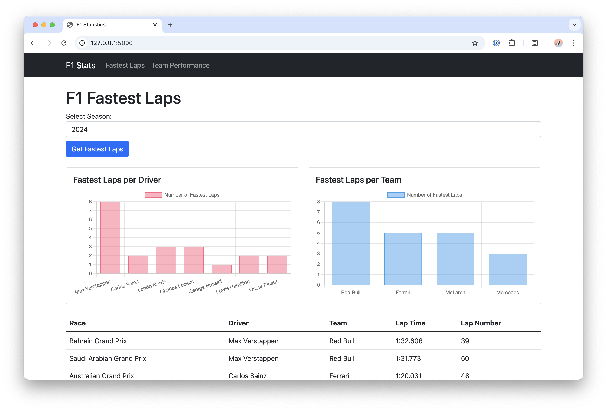

# F1 Stats Viewer

> [!NOTE]
> This is just a toy project created while experimenting with AI-assisted development (specifically Cursor).



A simple Flask application that displays Formula 1 statistics, including fastest laps and race winners. This is a toy project created while experimenting with AI-assisted development.

## Overview

This web application allows users to:
- View fastest lap times for any F1 season
- Check team performance statistics
- Browse race winners by season
- Compare team performances across different races

## Technical Stack

- **Backend**: Flask + SQLAlchemy
- **Database**: PostgreSQL
- **Testing**: pytest with Testcontainers
- **Development**: Dev Containers for consistent development environment

## Setup

1. Clone this repository
2. Ensure Docker is installed on your system
3. Open in VS Code with Dev Containers extension
4. Let the dev container build
5. `docker compose up` to start the database (not yet using Testcontainers)
6. Run `flask run` to start the application

## Development

The project uses Dev Containers to ensure consistent development environments. 
The test suite can be run with:
```
pytest tests/
```


## Features

- Season selection for viewing fastest lap data
- Team statistics dashboard
- Race winner tracking
- Error handling for invalid data requests
- Responsive data tables

## Note

This is a learning project and not intended for production use. It serves as an example of working with:
- Flask web applications
- SQL databases in Python
- Integration testing with Testcontainers
- Devcontainer configurations

## License

MIT
